<p align="center">
    
    <h1 style="text-align:center; margin:0">Bantay Bayan</h1>
    <p style="text-align:center; margin:0">Bantay Bayan is a web application that promotes government accountability by allowing citizens to monitor municipal projects, track budgets, and ensure transparency in Quezon City's development initiatives. The platform serves as a social-media-style interface where users can view project status, completion progress, and report concerns about potential ghost projects
</p>
</p>

## Screenshots

### Home

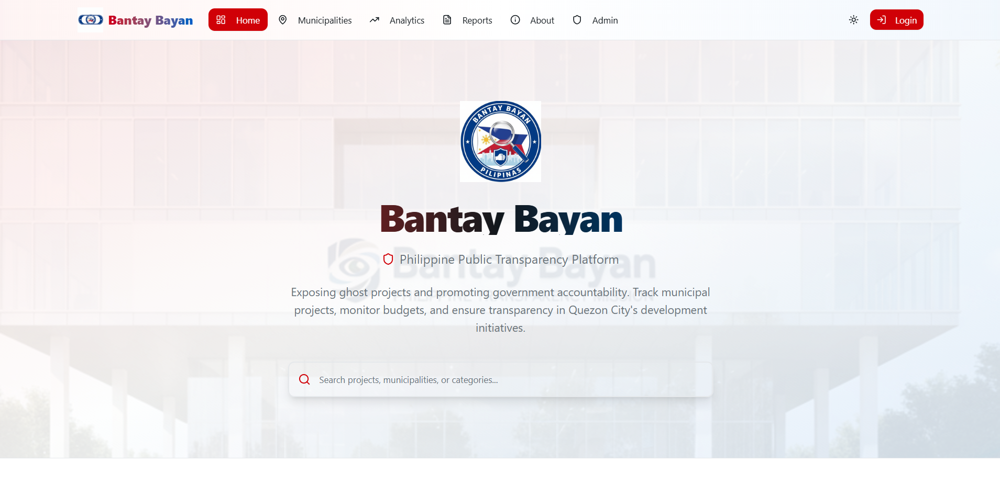
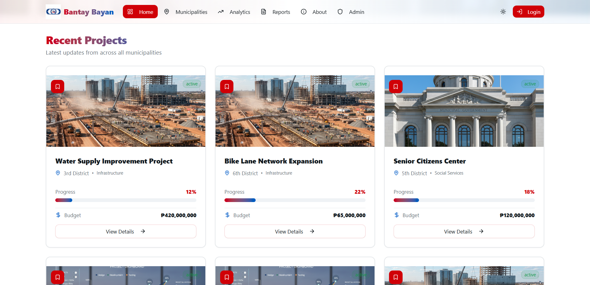
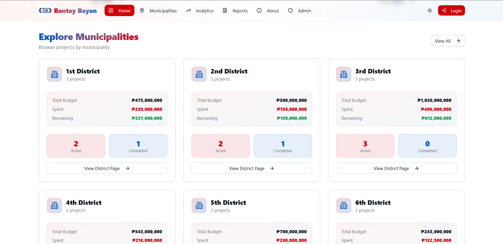

### Municipalities

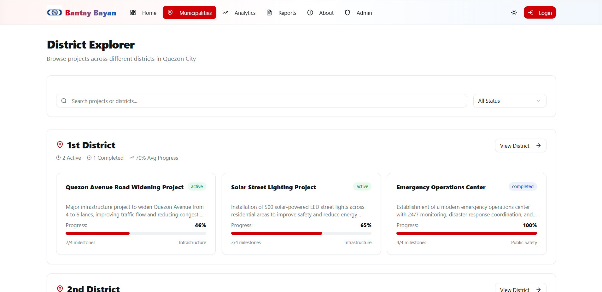

### Analytics

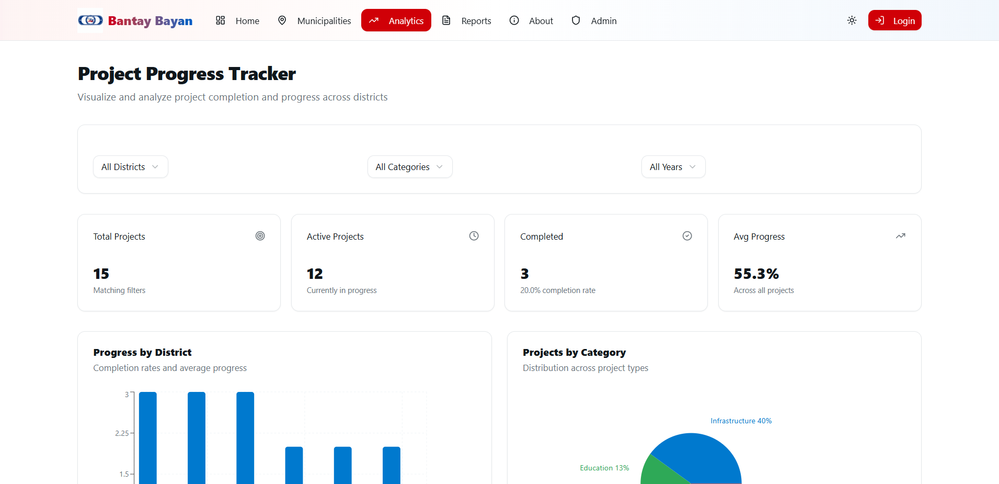
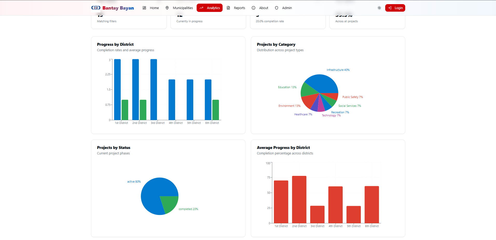

### Report

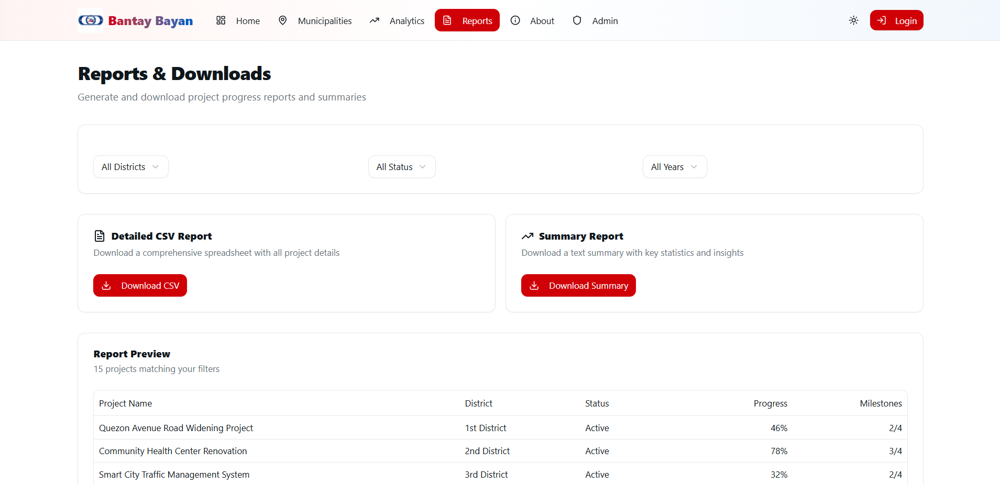

### About

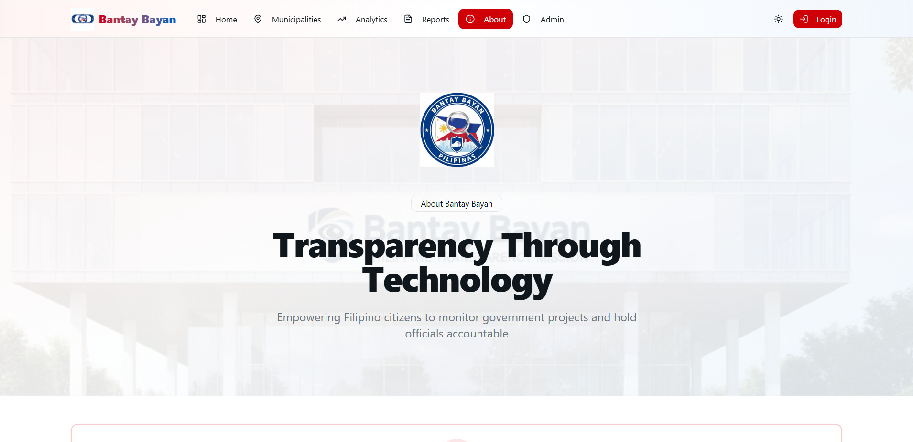
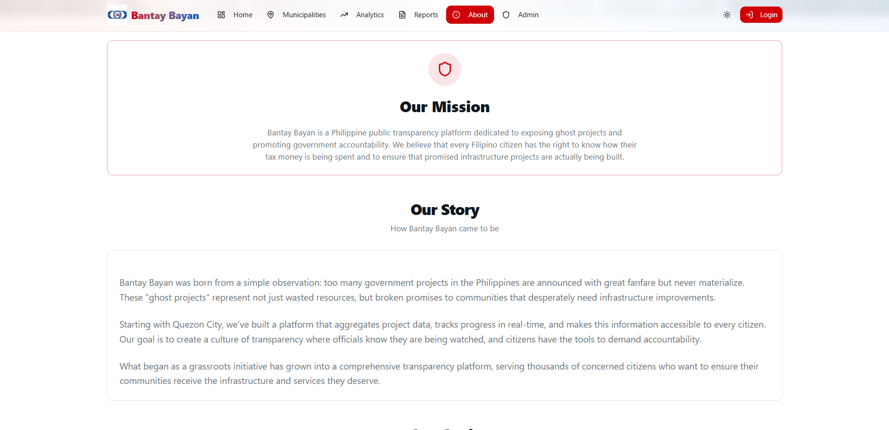
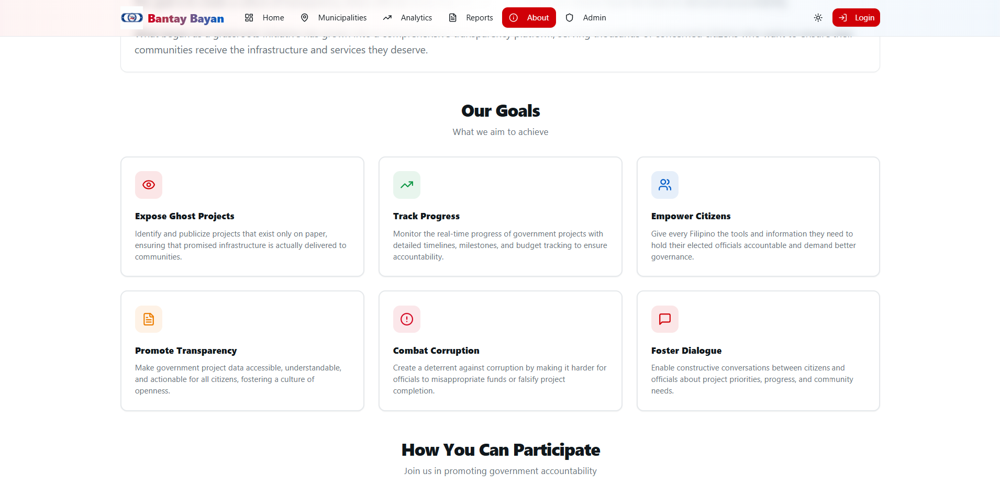

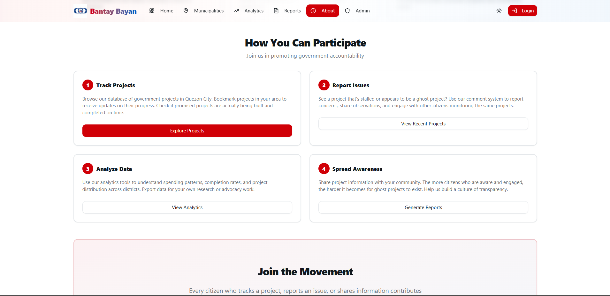

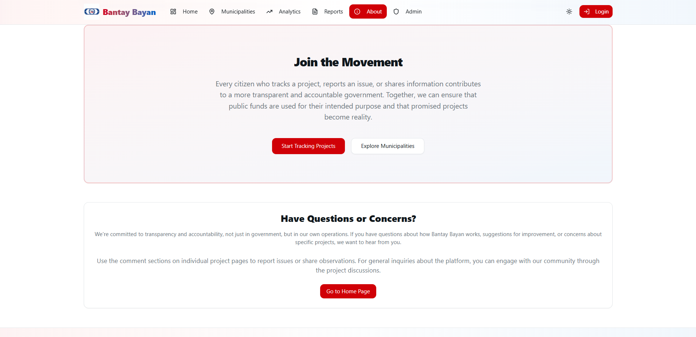

### Admin

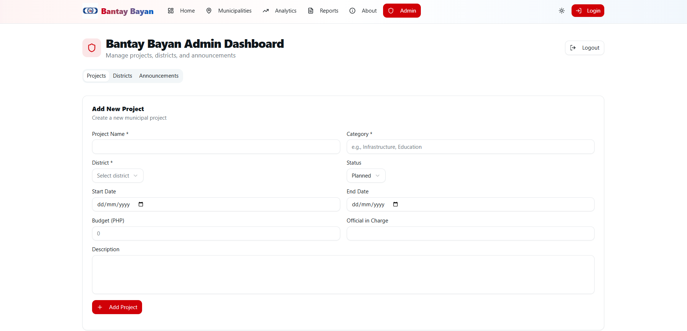

### Dark Mode

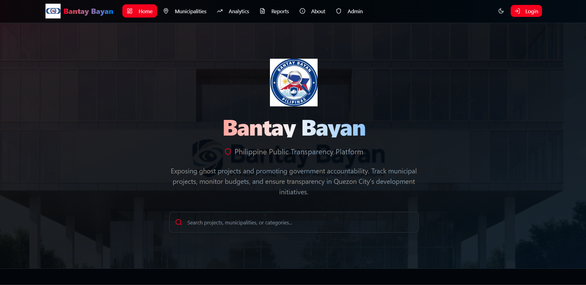
<!--
## Features

- Track government projects across all 6 congressional districts in Quezon City
- View project progress, budgets, and timelines
- Bookmark projects for updates
- Search and filter projects by district, category, status, and year
- Analytics and data visualizations
- Export reports in CSV and PDF formats
- Public commenting on projects
- Admin dashboard for project management


## Tech Stack

- **Backend**: Motoko (Internet Computer)
- **Frontend**: React + TypeScript
- **Routing**: TanStack Router
- **Styling**: Tailwind CSS
- **Data Fetching**: React Query 

## Prerequisites

- Node.js v18 or higher
- pnpm
- DFINITY SDK (dfx)

## Setup

### Backend Setup

```bash
cd backend
dfx start --clean
dfx deploy
```

### Frontend Setup

```bash
cd frontend
pnpm install
pnpm dev
```
-->
